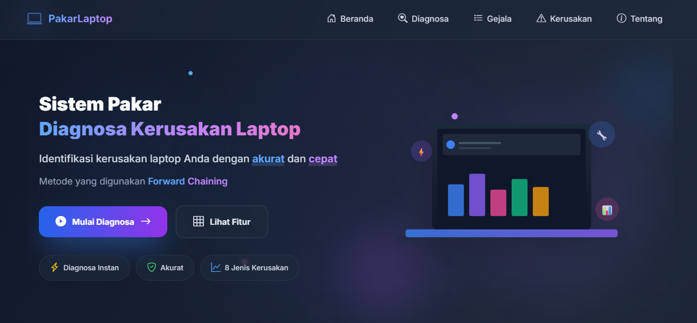

<!-- ================= HEADER ================= -->
<p align="center">
  
</p>


<p align="center">
  
</p>

<p align="center">
  
  
  
  
</p>

<div align="center">
  
</div>

<br>

## 📖 Tentang Proyek

**PakarLaptop** adalah **aplikasi web sistem pakar** yang membantu mendiagnosa kerusakan laptop berdasarkan gejala yang dipilih pengguna.  
Menggunakan metode **Forward Chaining** (rule-based inference) untuk menyimpulkan kerusakan secara logis dan memberikan **solusi perbaikan** yang praktis.

<div align="center">
  
</div>


## 🚀 Cara Menjalankan di Lokal (Step-by-Step)

```bash
# 1. Clone repo
git clone https://github.com/Alfarobby27/PakarLaptop.git

# 2. Masuk ke direktori
cd PakarLaptop

# 3. Buat & aktifkan virtual environment (sangat direkomendasikan)
python -m venv venv

# Windows (CMD)
venv\Scripts\activate

# Windows (PowerShell)
.\venv\Scripts\Activate.ps1

# Linux / macOS
source venv/bin/activate

# 4. Install dependensi
pip install --upgrade pip
pip install -r requirements.txt

# 5. Jalankan aplikasi
# Cara 1: simple
python api/index.py

# Cara 2: dengan debug mode (auto-reload saat edit kode)
flask --app api/index --debug run
```

Buka browser:

```
http://localhost:5000
atau
http://127.0.0.1:5000
```

<div align="center">
  
</div>


## 👥 Anggota Kelompok 2

| NPM          | Nama |
| ------------ | ----------------------------------------------------------- |
| 202243500496 | Muhamad Suhada |
| 202243500497 | [Alfarobby](https://github.com/Alfarobby27) |
| 202243500500 | [Ahmad Badawi](https://github.com/Ahmadbadawi123) |
| 202243500501 | [Abdur Rosyid Fachriansyah](https://github.com/dellwatch21) |
| 202243500502 | [Sangga Buana](https://github.com/sanggabuana453) |
| 202243500540 | Novia Citra Sholihah |
| 202243500503 | Rani Stevidayanti |
| 202243500538 | Raditha Andaliaripa |

<div align="center">
  
</div>

## 🛠️ Teknologi yang Digunakan

<p align="center">

[](https://www.python.org/)
&nbsp;&nbsp;
[](https://flask.palletsprojects.com/)
&nbsp;&nbsp;
[](https://jinja.palletsprojects.com/)

<br>

[](https://developer.mozilla.org/en-US/docs/Web/HTML)
&nbsp;&nbsp;
[](https://tailwindcss.com/)
&nbsp;&nbsp;
[](https://vercel.com/)

</p>

<div align="center">
  
</div>

## 🧠 Sumber Pengetahuan (Pakar Digital)

Basis pengetahuan sistem disusun berdasarkan referensi teknisi laptop profesional berikut:

<p align="center">
  <a href="https://youtu.be/Wq_w8ZQ9PnQ" target="_blank">
    
  </a>
</p>

<p align="center">
  <a href="https://youtu.be/Wq_w8ZQ9PnQ" target="_blank">
    
  </a>
</p>

<div align="center">
  
</div>


## 🚀 Demo Program

<p align="center">
  <!-- Gambar lokal -->
  
</p>

<p align="center">
  <a href="https://pakarlaptop.vercel.app" target="_blank">
    
  </a>
</p>
